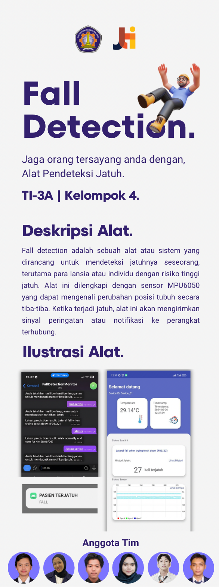

# Fall-Detection-Project
Proyek alat deteksi jatuh berbasis NodeMPU ESP8266 / ESP32

### Anggota Kelompok:
- 2141720133 - Brian Mohamad Safiudin
- 2141720225 - Muhammad Akbar Nur Ihsan
- 2141720080 - Muhammad Haikal Buldan
- 2341728036 - Muhammad Mujaddid Ihsan
- 2141720135 - Mutiara Devita Eka Putri
- 2341728033 - Sufina

# License

Copyright (c) 2024 Fall Detection Development Team

This package is released under the MIT license. See [LICENSE](LICENSE) for details.
